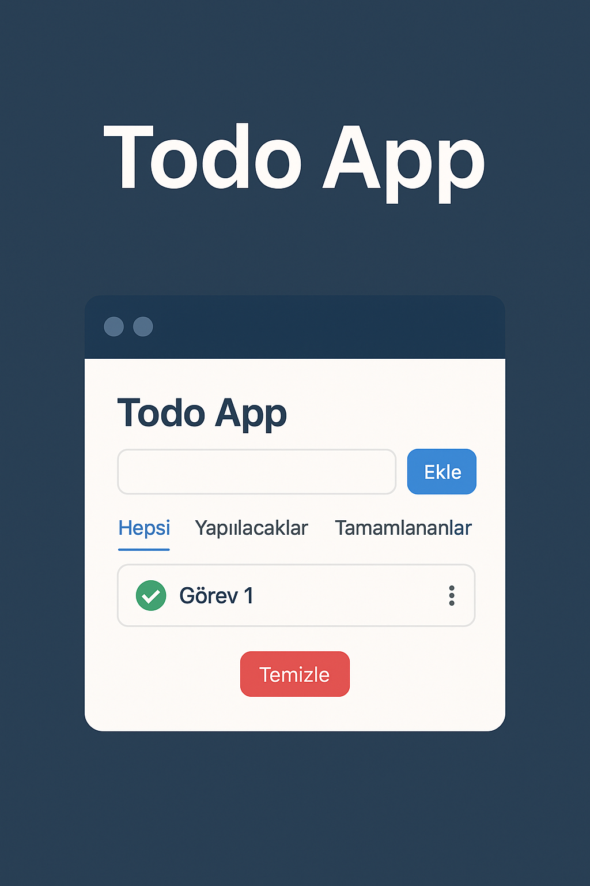

# ✅ Todo App



A simple, user-friendly, and fully browser-based task management application. Developed using HTML, CSS (Bootstrap), JavaScript, and `localStorage`. With features like adding, editing, deleting, and filtering tasks, you can easily organize your daily to-dos.

---
## 📝 Reviews & Feedback

We’d love to hear your thoughts! 🚀  
If you try this project and have suggestions, ideas, or improvements:

- ⭐ Star the repository if you found it useful  
- 🐛 Open an [issue](https://github.com/dugerdev/todo-app/issues) for bugs or feature requests  
- 💬 Share feedback to help make the app better  

Your input is highly appreciated and helps improve this project for everyone. 🙌

## 📌 Features

- 📝 Add tasks
- ✔️ Mark tasks as completed
- 🗑️ Delete tasks
- ✏️ Edit tasks
- 🔍 Filter tasks (All / Pending / Completed)
- 💾 Data is stored in **LocalStorage** (tasks remain even after page refresh)

---

## 🛠️ Technologies Used

| Technology   | Description                  |
|-------------|------------------------------|
| HTML        | Page structure and content   |
| CSS/Bootstrap | Responsive design           |
| JavaScript  | Dynamic task management      |
| LocalStorage| Data storage in browser      |
| Font Awesome| Icon support                 |

---

## 🖥️ Run the Project Locally

1. Download the repository via `Code` > `Download ZIP` or use `git clone`:

```bash
git clone https://github.com/dugerdev/todo-app.git


